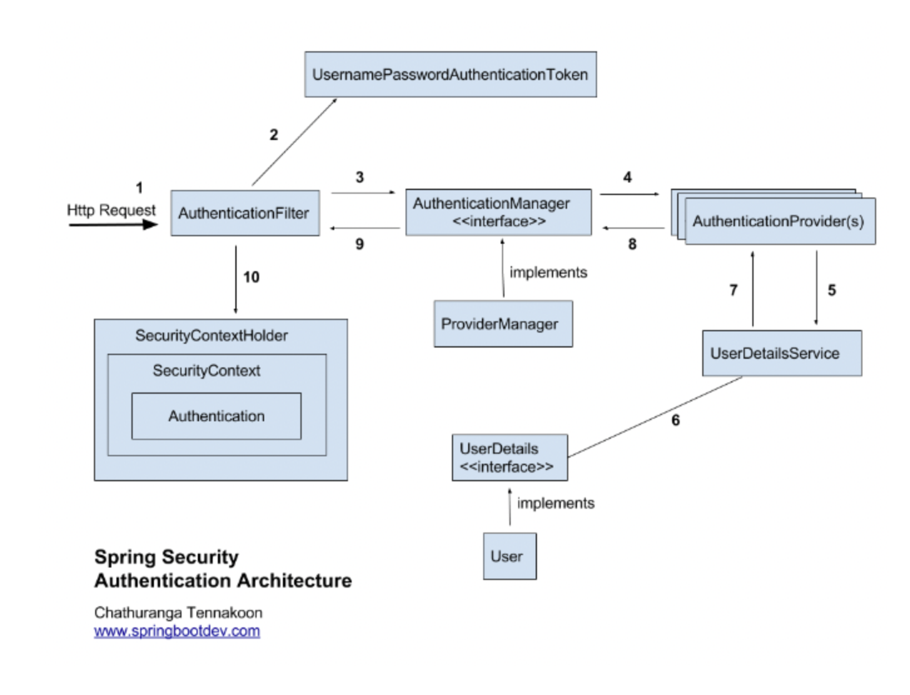

일반적인 Form Login 절차

1. 요청 수신

- 사용자가 form을 통해 로그인 정보가 담긴 Request를 보낸다.

2. 토큰 생성

- AuthenticationFilter가 요청을 받아서 UsernamePasswordAuthenticationToken토큰(인증용 객체)을 생성
- UsernamePasswordAuthenticationToken은 해당 요청을 처리할 수 있는 Provider을 찾는데 사용

3. AuthenticationFilter로 부터 인증용 객체를 전달 받는다.

- Authentication Manager에게 처리 위임(실제 기능하는 메서드는 ProviderManager에 만들어져있음. AuthenticationManager구현체임)
- Authentication Manager는 List형태로 Provider들을 갖고 있다.

4. Token을 처리할 수 있는 Authentication Provider 선택

- 실제 인증을 할 AuthenticationProvider에게 인증용 객체를 다시 전달한다.
  (AuthenticationProvider에서 비번체크)

> DaoAuthenticationProvider 클래스

```java

    private void mitigateAgainstTimingAttack(UsernamePasswordAuthenticationToken authentication) {
        if (authentication.getCredentials() != null) {
            String presentedPassword = authentication.getCredentials().toString();
            this.passwordEncoder.matches(presentedPassword, this.userNotFoundEncodedPassword);
        }

    }
```

5. 인증 절차

- 인증 절차가 시작되면 AuthenticationProvider 인터페이스가 실행되고 DB에 있는 사용자의 정보와 화면에서 입력한 로그인 정보를 비교

6. UserDetailsService의 loadUserByUsername메소드 수행

- AuthenticationProvider 인터페이스에서는 authenticate() 메소드를 오버라이딩 하게 되는데 이 메소드의 파라미터인 인증용 객체로 화면에서 입력한 로그인 정보를 가져올 수 있다.

7. AuthenticationProvider 인터페이스에서 DB에 있는 사용자의 정보를 가져오려면, UserDetailsService 인터페이스를 사용한다.
   (비번체크)

8. UserDetailsService 인터페이스는 화면에서 입력한 사용자의 username으로 loadUserByUsername() 메소드를 호출하여 DB에 있는 사용자의 정보를 UserDetails 형으로 가져온다. 만약 사용자가 존재하지 않으면 예외를 던진다. 이렇게 DB에서 가져온 이용자의 정보와 화면에서 입력한 로그인 정보를 비교하게 되고, 일치하면 Authentication 참조를 리턴하고, 일치 하지 않으면 예외를 던진다.

9. 인증이 완료되면 사용자 정보를 가진 Authentication 객체를 SecurityContextHolder에 담은 이후 AuthenticationSuccessHandle를 실행한다.(실패시 AuthenticationFailureHandler를 실행한다.)

## UserDetails

- 인증 성공 후 생성된 UserDetails 객체
- Authentication객체를 구현한 UsernamePasswordAuthenticationToken을 생성하기 위해 사용

- UserDetails는 UserDetailsService가 리턴하는 값이다.  
  DaoAuthenticationProvider가 UserDetails를 인증하고  
  이 UserDetails를 Princiapl로 가진 Authentication을 리턴한다.

```java
@Data
public class CustomUserDetails implements UserDetails {

    //내 엔티티 User 를 객체로 가지고 있음.
    private User user; // 콤포지션

    public CustomUserDetails(User user) {
        this.user = user;
    }

    // 해당 User의 권한을 리턴하는 곳! 모양이 그냥 Collection<? extends GrantedAuthority>인 것 뿐!
    @Override
    public Collection<? extends GrantedAuthority> getAuthorities() {
//        user.getRole();
        Collection<GrantedAuthority> collect = new ArrayList<>();
        collect.add(()->user.getRole());
        return collect;
    }

    @Override
    public String getPassword() {
        return user.getPassword();
    }

    @Override
    public String getUsername() {
        return user.getUsername();
    }

    // 만료됐니?
    @Override
    public boolean isAccountNonExpired() {
        return true;
    }

    // 계정 잠겼니?
    @Override
    public boolean isAccountNonLocked() {
        return true;
    }

    // 비밀번호 만료기간이 지났니?
    @Override
    public boolean isCredentialsNonExpired() {
        return true;
    }

    // 니 계정이 활성화 되어 있니?
    @Override
    public boolean isEnabled() {
        // 우리 사이트!! 1년 동안 회원이 로그인을 안 하면 -> 휴먼 계정으로 하기로 함
        // 현재시간 - 로그인시간 => 1년 초과하면 return false;
        // 그러면 휴먼계정이다~ 페이지로 리다이렉트
        return true;
    }
}

```

- 사용자 정보 담는 인터페이스
- username은 계정의 고유한 값인데 다른 블로그들을 보니까 다들 email( 로그인용 아이디 )을 넘겨준다고 하지만 email( 로그인용 아이디 )은 SSO 같은 서버를 만들게 되면 정책에 따라서 중복이 될 수도 있기에 나와 같은 경우는 보통 DB에서 User Table에 PK 값을 넘겨준다.
  https://programmer93.tistory.com/68
